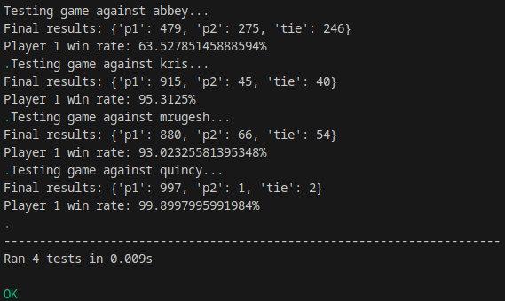

# freeCodeCamp Machine Learning with Python Certificate

These are the projects I did in the completion of this certificate.

## Projects

### Rock Paper Scissors

Plays the game Rock Paper Scissors. The program works by keeping track of sets of moves (I set it to 7 in the program as this seemed to work well). It then predicts the next move by looking at the previous 6, making combinations for the possible moves, and seeing which one occured the highest.

## Skills

- Python

## Development Tools

- [VS Code](https://code.visualstudio.com/) - Development environment
- [Git](https://git-scm.com/)/[GitHub](https://github.com/) - Version control

## Running the Projects

You will need Python and any associated modules installed to run the projects locally.
