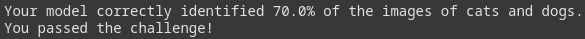
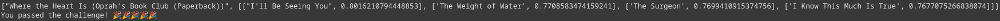
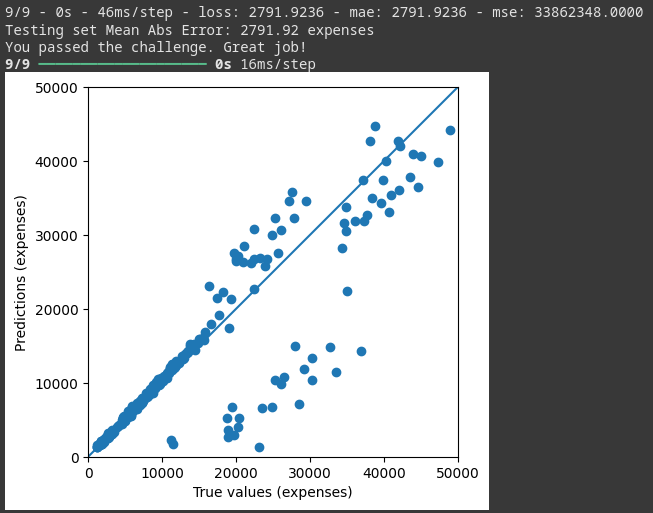
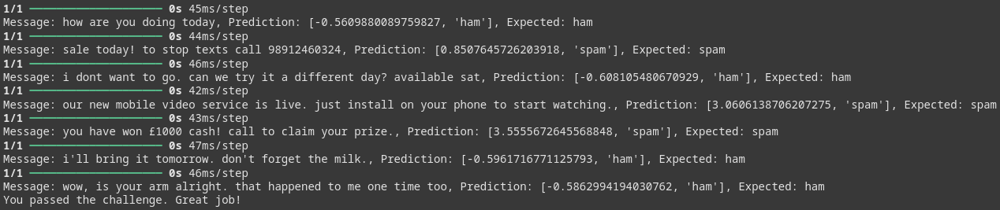

# freeCodeCamp Machine Learning with Python Certificate

These are the projects I did in the completion of this certificate.

[Here](https://www.freecodecamp.org/certification/fcc30aca8b2-d2c4-4009-a397-2e6d1ecbde3b/machine-learning-with-python-v7) is my certificate on freeCodeCamp.

## Projects

### Rock Paper Scissors

Plays the game Rock Paper Scissors. The program works by keeping track of sets of moves (I set it to 7 in the program as this seemed to work well). It then predicts the next move by looking at the previous 6, making combinations for the possible moves, and seeing which one occured the highest.

### Cat and Dog Image Classifier

Uses a convolutional neural network to make predictions on images of cats and dogs. The program is implemented using Python, Tensorflow, and Keras. I did not write the program locally, instead I used Google Colab starting from boilerplate provided by freeCodeCamp. My project can be accessed [here](https://colab.research.google.com/drive/1EDdNHLyxvXSt_o9OObPdII-g4WfKZM8z?usp=sharing), and a local copy is available in this repo.

### Book Recommendation Engine using KNN

Recommends books using a K-Nearest Neighbors algorithm. When a book title is inputted, the program will return books that are similar based on the distance found by the algorithm. I wrote the program using Google Colab, accessible [here](https://colab.research.google.com/drive/1fd1kH5vDAcSE6qjiR0VrI2vQ6KU5rrFL?usp=sharing) or locally in this repo.

### Linear Regression Health Costs Calculator

Predicts healthcare costs using a regression algorithm. A dataset is used that contains information about people (not real people) and their healthcare costs. Categorical data is converted to numerical, then the dataset is split into training and testing data. Finally, normalization is applied and a Sequential model with Dense layers is used. I wrote the program using Google Colab, accessible [here](https://colab.research.google.com/drive/12OKyW6323E7hqWQW_aoVdWT2yTqQYQ-5?usp=sharing) or locally in this repo.

### Neural Network SMS Text Classifier

Predicts whether SMS text messages are spam or not. Training and testing datasets are provided that contain messages marked as "ham" for legitimate or "spam" for spam. The words are encoded as numeric, then a Sequential model with LSTM and Dense layers is used. Finally, I created a "predict_message" function that predicts a message against the model and returns a user readable output. I wrote the program using Google Colab, accessible [here](https://colab.research.google.com/drive/1_HTz7Vgas25A1XsEuVUXX9Pv8_6xighW?usp=sharing) or locally in this repo.

## Skills

- Python
- Tensorflow
- Keras
- Numpy
- Pandas
- Scipy
- Sklearn

## Development Tools

- [VS Code](https://code.visualstudio.com/) - Development environment
- [Google Colab](https://colab.research.google.com/) - Development environment
- [Git](https://git-scm.com/)/[GitHub](https://github.com/) - Version control

## Running the Projects

You will need Python and any associated modules installed to run the projects locally.
